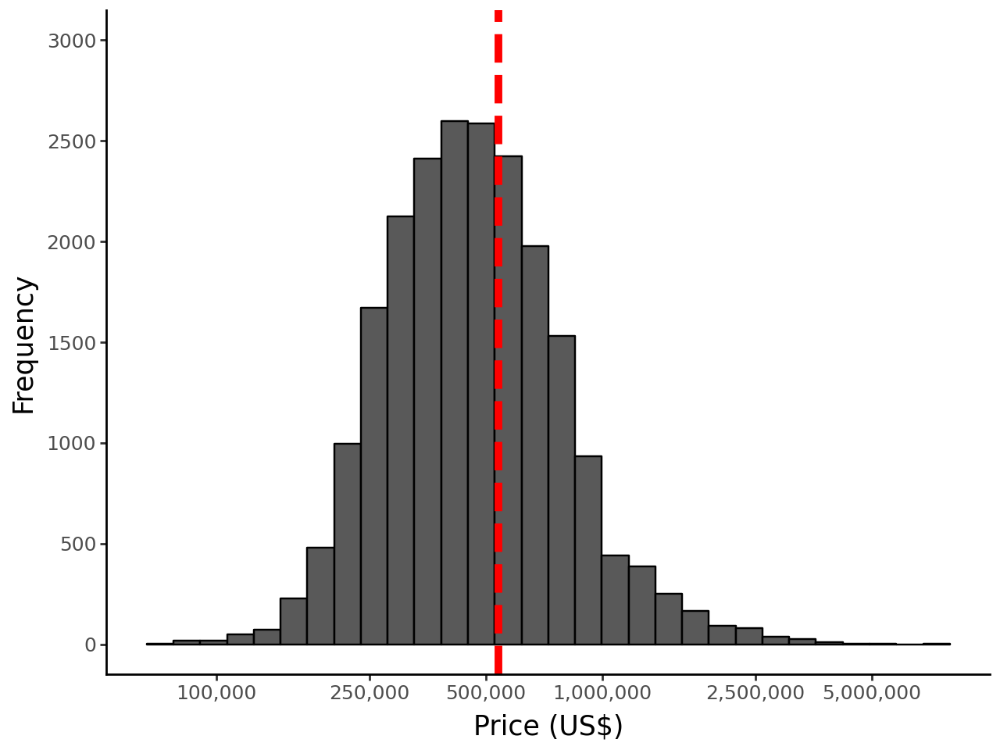
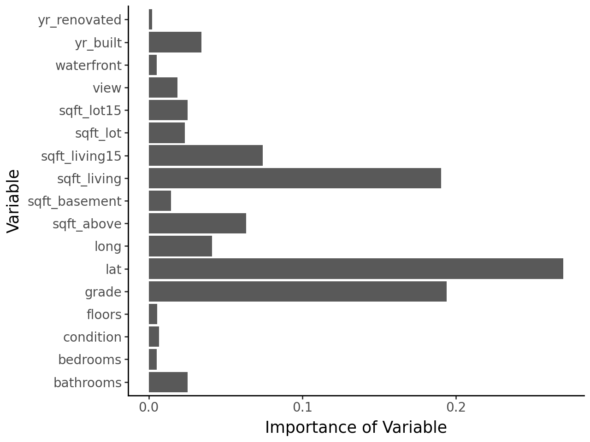

# Advanced Regression Techniques for Housing Price Prediction


## Overview

This project implements and compares multiple advanced regression techniques to predict housing prices in King County, Washington (Seattle area). Through systematic analysis, the project demonstrates the superiority of tree-based ensemble methods over traditional linear approaches for this dataset.

<p align="center">
  
</p>

## Objective

The goal of this project is to develop accurate models for predicting housing prices by:
- Evaluating multiple regression approaches, from linear models to ensemble methods
- Identifying key determinants of housing prices in the Seattle market
- Providing actionable insights for real estate stakeholders

## Dataset

The analysis uses the King County Housing Sales dataset containing information on 21,613 properties sold between May 2014 and May 2015. Each record includes 21 features such as:

- Sale price (target variable)
- Number of bedrooms and bathrooms
- Living space and lot square footage
- Location (latitude/longitude)
- Construction year
- Building grade and condition
- And more...

## Methods

The project implements a comprehensive data science workflow:

### 1. Exploratory Data Analysis (EDA)
- Price distribution analysis
- Temporal trends in construction and valuation
- Geographic price patterns
- Quality factors impact assessment
- Property configuration analysis

### 2. Linear Regression Methods
- Best subset selection
- Forward and backward stepwise selection
- Ridge and Lasso regression
- Principal Components Regression (PCR)
- Partial Least Squares (PLS)

### 3. Tree-based Methods
- Single regression trees
- Bagging (Bootstrap Aggregation)
- Random Forests
- Gradient Boosting

### 4. Evaluation
- 10-fold cross-validation
- Mean Squared Error (MSE) as primary metric
- Variable importance analysis

## Key Findings

- **Tree-based ensemble methods significantly outperform linear approaches**:
  - Gradient Boosting performs best (MSE: 0.0278)
  - Bagging (MSE: 0.0300) and Random Forest (MSE: 0.0309) follow closely
  - Best linear method (Ridge regression) has approximately twice the error (MSE: 0.0620)

- **Key price determinants identified**:
  - Location (latitude) is the most important predictor
  - Construction quality (grade) strongly influences price
  - Living area size is more important than lot size
  - Neighborhood context affects property values

<p align="center">
  
</p>

## Repository Structure

```
housing-price-prediction/
│
├── data/                          # Data files
│   └── kc_house_data.csv          # King County housing dataset
│
├── notebooks/                     # Jupyter notebooks
│   └── housing_price_prediction.ipynb  # Main analysis notebook
│
├── images/                        # Visualizations and plots
│   ├── price_distribution.png
│   ├── geographic_distribution.png
│   └── feature_importance.png
│
├── requirements.txt               # Required Python packages
├── LICENSE                        # License file
└── README.md                      # Project description
```

## Installation & Usage

### Prerequisites
- Python 3.7+
- Jupyter Notebook or JupyterLab

### Setup

1. Clone this repository:
```bash
git clone https://github.com/your-username/housing-price-prediction.git
cd housing-price-prediction
```

2. Create and activate a virtual environment (optional but recommended):
```bash
python -m venv venv
source venv/bin/activate  # On Windows: venv\Scripts\activate
```

3. Install required packages:
```bash
pip install -r requirements.txt
```

4. Download the dataset from [Kaggle](https://www.kaggle.com/harlfoxem/housesalesprediction) and place it in the `data/` directory

5. Run the notebook:
```bash
jupyter notebook notebooks/housing_price_prediction.ipynb
```

## References

- James, G., Witten, D., Hastie, T., & Tibshirani, R. (2013). *An Introduction to Statistical Learning with Applications in R*. Springer.
- Kuhn, M., & Johnson, K. (2013). *Applied Predictive Modeling*. Springer.
- Scikit-learn documentation for algorithm implementations

## Future Work

- Incorporate additional data sources (school quality, crime rates, walkability scores)
- Develop spatially explicit models to better account for neighborhood effects
- Create specialized models for different market segments (luxury homes, condos, etc.)
- Implement time series analysis to capture market trends and seasonality


